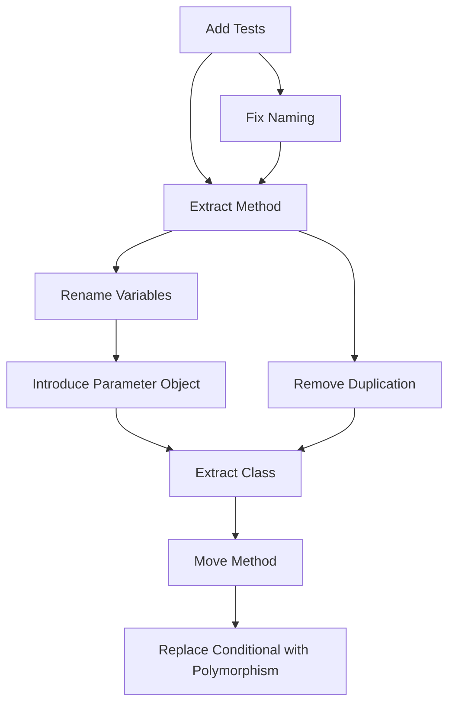

# Refactoring Rules - Additional Components

## Project-Specific Context for Vibe Coding Digest

### Domain-Specific Code Smells

#### Smell: Unhandled API Rate Limits
**ID:** `smell_unhandled_rate_limits`
**Severity:** High
**Description:** API calls without rate limit handling, risking service disruption.

**Detection Pattern:**
```bash
# Find API calls without rate limit handling
grep -r "openai\." . --include="*.py" | grep -v "retry\|RateLimitError"
grep -r "sendgrid\." . --include="*.py" | grep -v "retry\|RateLimitError"
```

**Example (Before):**
```python
def summarize_articles(articles):
    summaries = []
    for article in articles:  # Could hit rate limits!
        response = openai.ChatCompletion.create(
            model="gpt-3.5-turbo",
            messages=[{"role": "user", "content": f"Summarize: {article}"}]
        )
        summaries.append(response.choices[0].message.content)
    return summaries
```

**Example (After):**
```python
from tenacity import retry, stop_after_attempt, wait_exponential, retry_if_exception_type
from openai.error import RateLimitError
import time

class RateLimitedSummarizer:
    def __init__(self, max_rpm: int = 60):
        self.max_rpm = max_rpm
        self.last_request_time = 0
        self.request_count = 0
        
    @retry(
        stop=stop_after_attempt(3),
        wait=wait_exponential(multiplier=1, min=4, max=60),
        retry=retry_if_exception_type(RateLimitError)
    )
    def summarize_article(self, article: str) -> str:
        self._enforce_rate_limit()
        
        try:
            response = openai.ChatCompletion.create(
                model="gpt-3.5-turbo",
                messages=[{"role": "user", "content": f"Summarize: {article}"}],
                timeout=30
            )
            return response.choices[0].message.content
        except RateLimitError as e:
            logger.warning(f"Rate limit hit: {e}")
            raise
            
    def _enforce_rate_limit(self):
        current_time = time.time()
        time_since_last = current_time - self.last_request_time
        
        if time_since_last < 60:  # Within the same minute
            self.request_count += 1
            if self.request_count >= self.max_rpm:
                sleep_time = 60 - time_since_last
                logger.info(f"Rate limit reached, sleeping {sleep_time:.2f}s")
                time.sleep(sleep_time)
                self.request_count = 0
        else:
            self.request_count = 1
            
        self.last_request_time = current_time
```

#### Smell: Missing Feed Validation
**ID:** `smell_missing_feed_validation`
**Severity:** Medium
**Description:** RSS feed parsing without proper validation and sanitization.

**Example (Before):**
```python
def parse_feed(feed_url):
    feed = feedparser.parse(feed_url)
    items = []
    for entry in feed.entries:
        items.append({
            'title': entry.title,  # Could be missing!
            'link': entry.link,    # Could be malformed!
            'content': entry.summary  # Could contain malicious content!
        })
    return items
```

**Example (After):**
```python
import feedparser
import bleach
from urllib.parse import urlparse
from typing import Optional, List, Dict

class FeedValidator:
    ALLOWED_TAGS = ['p', 'br', 'strong', 'em', 'ul', 'ol', 'li', 'a']
    ALLOWED_ATTRIBUTES = {'a': ['href', 'title']}
    
    def parse_feed(self, feed_url: str) -> List[Dict]:
        """Parse and validate RSS feed entries."""
        try:
            feed = feedparser.parse(feed_url, agent='VibeCodingDigest/1.0')
            
            if feed.bozo:  # Feed parsing had issues
                logger.warning(f"Feed parsing issues for {feed_url}: {feed.bozo_exception}")
                
            return [
                validated 
                for entry in feed.entries[:50]  # Limit entries
                if (validated := self._validate_entry(entry))
            ]
        except Exception as e:
            logger.error(f"Failed to parse feed {feed_url}: {e}")
            return []
    
    def _validate_entry(self, entry) -> Optional[Dict]:
        """Validate and sanitize a single feed entry."""
        # Required fields
        if not all([
            hasattr(entry, 'title'),
            hasattr(entry, 'link'),
            self._is_valid_url(getattr(entry, 'link', ''))
        ]):
            return None
            
        return {
            'title': self._sanitize_text(entry.title),
            'link': self._sanitize_url(entry.link),
            'content': self._sanitize_html(getattr(entry, 'summary', '')),
            'published': self._parse_date(entry),
            'source': self._extract_source(entry.link)
        }
    
    def _sanitize_text(self, text: str) -> str:
        """Remove potentially harmful characters from text."""
        return bleach.clean(text, tags=[], strip=True).strip()
    
    def _sanitize_html(self, html: str) -> str:
        """Clean HTML content to prevent XSS."""
        return bleach.clean(
            html,
            tags=self.ALLOWED_TAGS,
            attributes=self.ALLOWED_ATTRIBUTES,
            strip=True
        )
    
    def _sanitize_url(self, url: str) -> str:
        """Validate and clean URLs."""
        parsed = urlparse(url)
        if parsed.scheme not in ['http', 'https']:
            raise ValueError(f"Invalid URL scheme: {parsed.scheme}")
        return url
    
    def _is_valid_url(self, url: str) -> bool:
        try:
            result = urlparse(url)
            return all([result.scheme, result.netloc])
        except:
            return False
```

### Project-Specific Refactoring Patterns

#### Pattern: Extract Email Template
**Use when:** HTML email generation is mixed with business logic
**Example:**
```python
# Before: Mixed concerns
def send_digest(items):
    html = "<html><body>"
    html += f"<h1>Daily Digest - {datetime.now().strftime('%B %d')}</h1>"
    for item in items:
        html += f"<h2>{item['title']}</h2>"
        html += f"<p>{item['summary']}</p>"
    html += "</body></html>"
    
    sendgrid_client.send(html)

# After: Separated template
from jinja2 import Template

class EmailTemplates:
    DIGEST_TEMPLATE = Template('''
    <!DOCTYPE html>
    <html>
    <head>
        <style>
            .digest-item { margin-bottom: 20px; }
            .item-title { color: #1a73e8; }
        </style>
    </head>
    <body>
        <h1>Daily Digest - {{ date }}</h1>
        
        <div class="digest-item">
            <h2 class="item-title">{{ item.title }}</h2>
            <p>{{ item.summary }}</p>
            <a href="{{ item.link }}">Read more</a>
        </div>
        
    </body>
    </html>
    ''')

def send_digest(items):
    html = EmailTemplates.DIGEST_TEMPLATE.render(
        date=datetime.now().strftime('%B %d'),
        items=items
    )
    sendgrid_client.send(html)
```

---

## Prioritization Framework

### Severity Scoring Matrix

| Factor | Weight | Score Range | Description |
|--------|--------|-------------|-------------|
| **Security Impact** | 40% | 0-10 | Risk of security vulnerabilities |
| **User Impact** | 25% | 0-10 | Effect on end-user experience |
| **Maintainability** | 20% | 0-10 | Long-term maintenance burden |
| **Performance** | 10% | 0-10 | Runtime performance impact |
| **Effort** | 5% | 0-10 | Development effort required |

### Smell Priority Calculation

```python
from dataclasses import dataclass
from enum import Enum
from typing import List

class Priority(Enum):
    CRITICAL = "critical"  # Score >= 8.0
    HIGH = "high"          # Score >= 6.0
    MEDIUM = "medium"      # Score >= 4.0
    LOW = "low"            # Score < 4.0

@dataclass
class SmellInstance:
    smell_id: str
    file_path: str
    line_number: int
    security_impact: float
    user_impact: float
    maintainability_impact: float
    performance_impact: float
    effort_to_fix: float
    
    @property
    def priority_score(self) -> float:
        """Calculate weighted priority score."""
        return (
            self.security_impact * 0.40 +
            self.user_impact * 0.25 +
            self.maintainability_impact * 0.20 +
            self.performance_impact * 0.10 +
            (10 - self.effort_to_fix) * 0.05  # Lower effort = higher priority
        )
    
    @property
    def priority(self) -> Priority:
        score = self.priority_score
        if score >= 8.0:
            return Priority.CRITICAL
        elif score >= 6.0:
            return Priority.HIGH
        elif score >= 4.0:
            return Priority.MEDIUM
        else:
            return Priority.LOW

# Example usage
smells = [
    SmellInstance(
        smell_id="smell_missing_error_handling",
        file_path="src/feeds.py",
        line_number=45,
        security_impact=8,  # API keys could be exposed
        user_impact=9,      # Service could fail
        maintainability_impact=6,
        performance_impact=2,
        effort_to_fix=3     # Easy to add try/except
    ),
    SmellInstance(
        smell_id="smell_long_method",
        file_path="src/vibe_digest.py",
        line_number=120,
        security_impact=2,
        user_impact=3,
        maintainability_impact=8,  # Hard to understand
        performance_impact=4,
        effort_to_fix=7     # Requires careful refactoring
    )
]

# Sort by priority
sorted_smells = sorted(smells, key=lambda s: s.priority_score, reverse=True)
```

### Refactoring Priority Guidelines

1. **Critical Priority** (Fix immediately):
   - Security vulnerabilities (hardcoded credentials, SQL injection risks)
   - Data loss risks (missing error handling in critical paths)
   - Service availability issues (unhandled API failures)

2. **High Priority** (Fix within sprint):
   - User-facing bugs
   - Performance bottlenecks in hot paths
   - Code that frequently causes production issues

3. **Medium Priority** (Plan for next milestone):
   - Maintainability issues in frequently modified code
   - Test coverage gaps in business-critical logic
   - Deprecated API usage

4. **Low Priority** (Address during refactoring sprints):
   - Style inconsistencies
   - Minor performance optimizations
   - Nice-to-have improvements

---

## Tool Integration

### Flake8 Configuration
```ini
# .flake8
[flake8]
max-line-length = 88
max-complexity = 10
exclude = .git,__pycache__,venv,.venv,build,dist
ignore = 
    # Allow lambda expressions
    E731,
    # Allow line break before binary operator (black compatibility)
    W503

# Custom plugins for project-specific smells
per-file-ignores =
    # Allow longer lines in test files
    tests/*.py: E501
    # Allow complexity in configuration files
    src/config.py: C901

# Enable plugins
enable-extensions = 
    # Detect cognitive complexity
    CCR001,
    # Detect mutable default arguments
    B006
```

### Pylint Configuration
```ini
# .pylintrc
[MASTER]
load-plugins=
    pylint.extensions.docparams,
    pylint.extensions.mccabe

[MESSAGES CONTROL]
enable=
    missing-function-docstring,
    missing-class-docstring,
    too-many-arguments,
    too-many-locals,
    too-many-branches,
    too-many-statements,
    too-many-instance-attributes,
    duplicate-code

[DESIGN]
max-args=5
max-locals=10
max-branches=10
max-statements=50
max-attributes=10
max-public-methods=20

[SIMILARITIES]
min-similarity-lines=4
ignore-comments=yes
ignore-docstrings=yes
```

### Pre-commit Hooks
```yaml
# .pre-commit-config.yaml
repos:
  - repo: https://github.com/pre-commit/pre-commit-hooks
    rev: v4.4.0
    hooks:
      - id: trailing-whitespace
      - id: end-of-file-fixer
      - id: check-yaml
      - id: check-added-large-files
      - id: check-merge-conflict
      
  - repo: https://github.com/psf/black
    rev: 23.3.0
    hooks:
      - id: black
        
  - repo: https://github.com/pycqa/flake8
    rev: 6.0.0
    hooks:
      - id: flake8
        additional_dependencies: 
          - flake8-docstrings
          - flake8-bugbear
          - flake8-comprehensions
          - flake8-simplify
          
  - repo: https://github.com/pre-commit/mirrors-mypy
    rev: v1.3.0
    hooks:
      - id: mypy
        additional_dependencies: [types-requests]
        
  - repo: local
    hooks:
      - id: detect-code-smells
        name: Detect Code Smells
        entry: python scripts/detect_smells.py
        language: system
        pass_filenames: true
        types: [python]
```

### Custom Smell Detection Script
```python
#!/usr/bin/env python3
# scripts/detect_smells.py

import ast
import sys
from pathlib import Path
from typing import List, Tuple

class SmellDetector(ast.NodeVisitor):
    def __init__(self):
        self.issues: List[Tuple[int, str, str]] = []
        
    def visit_FunctionDef(self, node):
        # Check for long methods
        if len(node.body) > 20:
            self.issues.append((
                node.lineno,
                "smell_long_method",
                f"Function '{node.name}' has {len(node.body)} statements"
            ))
            
        # Check for too many arguments
        if len(node.args.args) > 5:
            self.issues.append((
                node.lineno,
                "smell_long_parameter_list",
                f"Function '{node.name}' has {len(node.args.args)} parameters"
            ))
            
        self.generic_visit(node)
        
    def visit_Try(self, node):
        # Check for empty except blocks
        for handler in node.handlers:
            if len(handler.body) == 1 and isinstance(handler.body[0], ast.Pass):
                self.issues.append((
                    handler.lineno,
                    "smell_empty_catch",
                    "Empty except block suppresses all errors"
                ))
        self.generic_visit(node)

def analyze_file(filepath: Path) -> List[Tuple[int, str, str]]:
    with open(filepath) as f:
        tree = ast.parse(f.read())
    
    detector = SmellDetector()
    detector.visit(tree)
    return detector.issues

if __name__ == "__main__":
    exit_code = 0
    
    for filepath in sys.argv[1:]:
        path = Path(filepath)
        if path.suffix == '.py':
            issues = analyze_file(path)
            for line, smell_id, message in issues:
                print(f"{filepath}:{line}: {smell_id} - {message}")
                exit_code = 1
                
    sys.exit(exit_code)
```

---

## Visual Cross-Reference Matrix

### Smells to Refactorings Mapping

```mermaid
graph TD
    %% Bloaters
    smell_long_method --> ref_extract_method
    smell_long_method --> ref_replace_temp_with_query
    smell_long_method --> ref_decompose_conditional
    
    smell_large_class --> ref_extract_class
    smell_large_class --> ref_extract_subclass
    smell_large_class --> ref_extract_interface
    
    smell_primitive_obsession --> ref_replace_data_value_with_object
    smell_primitive_obsession --> ref_introduce_parameter_object
    smell_primitive_obsession --> ref_extract_class
    
    smell_long_parameter_list --> ref_introduce_parameter_object
    smell_long_parameter_list --> ref_preserve_whole_object
    smell_long_parameter_list --> ref_replace_parameter_with_method_call
    
    smell_data_clumps --> ref_introduce_parameter_object
    smell_data_clumps --> ref_extract_class
    smell_data_clumps --> ref_preserve_whole_object
    
    %% OO Abusers
    smell_switch_statements --> ref_replace_conditional_with_polymorphism
    smell_switch_statements --> ref_replace_type_code_with_subclasses
    smell_switch_statements --> ref_replace_type_code_with_state_strategy
    
    smell_refused_bequest --> ref_replace_inheritance_with_delegation
    smell_refused_bequest --> ref_push_down_method
    smell_refused_bequest --> ref_push_down_field
    
    %% Change Preventers
    smell_divergent_change --> ref_extract_class
    smell_divergent_change --> ref_move_method
    smell_divergent_change --> ref_move_field
    
    smell_shotgun_surgery --> ref_move_method
    smell_shotgun_surgery --> ref_move_field
    smell_shotgun_surgery --> ref_inline_class
    
    %% Dispensables
    smell_duplicate_code --> ref_extract_method
    smell_duplicate_code --> ref_pull_up_method
    smell_duplicate_code --> ref_form_template_method
    smell_duplicate_code --> ref_extract_class
    
    smell_dead_code --> ref_remove_parameter
    smell_dead_code --> ref_inline_method
    smell_dead_code --> ref_inline_class
    
    %% Couplers
    smell_feature_envy --> ref_move_method
    smell_feature_envy --> ref_extract_method
    smell_feature_envy --> ref_move_field
    
    smell_inappropriate_intimacy --> ref_move_method
    smell_inappropriate_intimacy --> ref_move_field
    smell_inappropriate_intimacy --> ref_extract_class
    smell_inappropriate_intimacy --> ref_hide_delegate
    
    smell_message_chains --> ref_hide_delegate
    smell_message_chains --> ref_extract_method
    smell_message_chains --> ref_move_method
```



### Quick Reference Table

| Code Smell | Primary Refactorings | Secondary Refactorings |
|------------|---------------------|----------------------|
| **Long Method** | Extract Method | Replace Temp with Query, Decompose Conditional |
| **Large Class** | Extract Class | Extract Subclass, Extract Interface |
| **Primitive Obsession** | Replace Data Value with Object | Introduce Parameter Object |
| **Long Parameter List** | Introduce Parameter Object | Preserve Whole Object |
| **Data Clumps** | Extract Class | Introduce Parameter Object |
| **Switch Statements** | Replace Conditional with Polymorphism | Replace Type Code with Subclasses |
| **Feature Envy** | Move Method | Extract Method, Move Field |
| **Duplicate Code** | Extract Method | Pull Up Method, Form Template Method |
| **Shotgun Surgery** | Move Method/Field | Inline Class |
| **Message Chains** | Hide Delegate | Extract Method |

---

## Incremental Refactoring Guide

### Safe Refactoring Process

#### Phase 1: Preparation (Day 1)
1. **Identify Target**
   - Run smell detection tools
   - Calculate priority scores
   - Select highest priority smell

2. **Ensure Test Coverage**
   ```bash
   # Check current coverage
   pytest --cov=src --cov-report=html
   
   # If coverage < 80% for target code:
   # Write characterization tests first
   ```

3. **Create Feature Branch**
   ```bash
   git checkout -b refactor/smell-id-description
   ```

#### Phase 2: Incremental Changes (Days 2-3)

**Step 1: Extract Method (Safe Starting Point)**
```python
# Original
def process_all():
    # Setup code
    items = []
    for x in source:
        items.append(transform(x))
    
    # Processing code - Extract this
    results = []
    for item in items:
        if item.valid:
            processed = complex_operation(item)
            results.append(processed)
    
    # Cleanup code
    return format_results(results)

# Step 1: Extract processing
def process_all():
    items = _collect_items(source)
    results = _process_valid_items(items)  # Extracted
    return format_results(results)

def _process_valid_items(items):
    results = []
    for item in items:
        if item.valid:
            processed = complex_operation(item)
            results.append(processed)
    return results
```

**Step 2: Run Tests After Each Change**
```bash
# After each refactoring step
pytest tests/test_affected_module.py -v
flake8 src/affected_module.py
```

**Step 3: Commit Incrementally**
```bash
git add -p  # Stage specific changes
git commit -m "refactor: extract _process_valid_items method"
```

#### Phase 3: Larger Refactorings (Days 4-5)

**For Large Class → Extract Class:**

1. **Identify Cohesive Groups**
   ```python
   # Analyze method usage
   class DigestService:
       # Group 1: Feed methods
       def add_feed(): ...
       def remove_feed(): ...
       def fetch_feeds(): ...
       
       # Group 2: Email methods  
       def send_email(): ...
       def format_email(): ...
       
       # Group 3: Processing methods
       def summarize(): ...
       def filter(): ...
   ```

2. **Extract One Group at a Time**
   ```python
   # Step 1: Create new class with delegation
   class FeedManager:
       def add_feed(): ...
       def remove_feed(): ...
       def fetch_feeds(): ...
   
   class DigestService:
       def __init__(self):
           self.feed_manager = FeedManager()
       
       # Delegate (temporary)
       def add_feed(self, url):
           return self.feed_manager.add_feed(url)
   ```

3. **Update Callers Gradually**
   ```python
   # Update callers one by one
   # Old: service.add_feed(url)
   # New: service.feed_manager.add_feed(url)
   ```

4. **Remove Delegating Methods**
   ```python
   # Final: Remove delegation methods after all callers updated
   ```

### Refactoring Checkpoints

```python
# refactoring_checklist.py
from dataclasses import dataclass
from datetime import datetime
from typing import List

@dataclass
class RefactoringCheckpoint:
    timestamp: datetime
    description: str
    tests_passing: bool
    coverage_percent: float
    smell_count_before: int
    smell_count_after: int

class RefactoringTracker:
    def __init__(self, target_file: str):
        self.target_file = target_file
        self.checkpoints: List[RefactoringCheckpoint] = []
        
    def checkpoint(self, description: str):
        """Create a refactoring checkpoint."""
        # Run tests
        tests_passing = self._run_tests()
        
        # Check coverage
        coverage = self._check_coverage()
        
        # Count smells
        smell_count = self._count_smells()
        
        checkpoint = RefactoringCheckpoint(
            timestamp=datetime.now(),
            description=description,
            tests_passing=tests_passing,
            coverage_percent=coverage,
            smell_count_before=self.checkpoints[-1].smell_count_after if self.checkpoints else smell_count,
            smell_count_after=smell_count
        )
        
        self.checkpoints.append(checkpoint)
        
        if not tests_passing:
            raise Exception(f"Tests failing at checkpoint: {description}")
            
    def generate_report(self):
        """Generate refactoring progress report."""
        print(f"Refactoring Report for {self.target_file}")
        print("=" * 50)
        
        for cp in self.checkpoints:
            print(f"\n{cp.timestamp}: {cp.description}")
            print(f"  Tests: {'✓' if cp.tests_passing else '✗'}")
            print(f"  Coverage: {cp.coverage_percent:.1f}%")
            print(f"  Smells: {cp.smell_count_before} → {cp.smell_count_after}")
```

### Rollback Strategy

```bash
#!/bin/bash
# scripts/refactoring_safety.sh

# Save current state before major refactoring
git stash
git checkout -b refactoring-backup-$(date +%Y%m%d-%H%M%S)
git stash pop

# Create checkpoint commits
function checkpoint() {
    local message=$1
    git add -A
    git commit -m "CHECKPOINT: $message"
    
    # Run tests
    if ! pytest; then
        echo "Tests failed! Rolling back to previous checkpoint"
        git reset --hard HEAD^
        return 1
    fi
}

# Example usage:
# checkpoint "Extracted email formatting logic"
# checkpoint "Moved feed processing to separate class"
```

### Refactoring Dependencies Order



### Common Refactoring Patterns for This Project

1. **API Client Extraction Pattern**
   ```python
   # Before: Mixed in service class
   class DigestService:
       def summarize(self, text):
           response = openai.Completion.create(...)
           return response.choices[0].text
   
   # After: Dedicated client
   class OpenAIClient:
       def __init__(self, api_key: str):
           self.client = OpenAI(api_key=api_key)
           
       def summarize(self, text: str) -> str:
           # Handles retries, rate limits, errors
           pass
   ```

2. **Configuration Extraction Pattern**
   ```python
   # Before: Hardcoded values
   class EmailSender:
       def __init__(self):
           self.from_email = "digest@vibecoding.com"
           self.subject_prefix = "[Vibe Digest]"
   
   # After: Configuration object
   @dataclass
   class EmailConfig:
       from_email: str
       subject_prefix: str
       
       @classmethod
       def from_env(cls):
           return cls(
               from_email=os.getenv('FROM_EMAIL'),
               subject_prefix=os.getenv('SUBJECT_PREFIX', '[Vibe Digest]')
           )
   ```

3. **Error Handler Extraction Pattern**
   ```python
   # Before: Scattered error handling
   try:
       result = api_call()
   except Exception as e:
       print(f"Error: {e}")
       return None
   
   # After: Centralized handler
   class ErrorHandler:
       @staticmethod
       def handle_api_error(func):
           @functools.wraps(func)
           def wrapper(*args, **kwargs):
               try:
                   return func(*args, **kwargs)
               except RateLimitError:
                   # Specific handling
               except APIError as e:
                   logger.error(f"API error in {func.__name__}: {e}")
                   # Graceful degradation
           return wrapper
   ```

This comprehensive guide provides all the remaining components for a complete refactoring system tailored to the Vibe Coding Digest project.